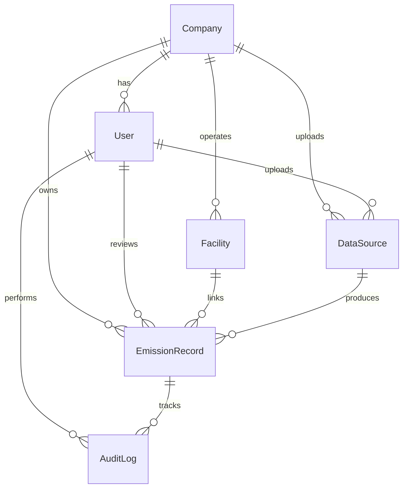

# Data Model Specification

This document details the database schema and architecture designed for the ESG Emission tracking platform, detailing how it enforces multi-tenancy, processes Scope 1/2/3 greenhouse gas classifications, tracks source-of-truth provenance, normalizes raw physical quantities, and maintains an immutable audit trail.

---

## Entity-Relationship Architecture

The application uses a shared-database, shared-schema relational database design. Multi-tenancy is enforced logically at the row level via foreign keys.



---

## 1. Multi-Tenancy (Logical Row-Level Isolation)

To ensure strict tenant isolation, every core entity is scoped to a `Company` record. 

* **`Company` Model:** Serves as the tenant container. All data (users, facilities, uploads, emission records) belongs to exactly one company.
* **`User` Model:** Custom User model extending Django's `AbstractUser`, containing a mandatory `company` foreign key.
* **Query Filtering:** Querysets are filtered at the Django view layer using the authenticated user's company (`company=request.user.company`). This prevents cross-tenant data leaks.
* **Unique Constraints:** Composite unique constraints (such as `unique_together = [("company", "sap_plant_code")]` in the `Facility` model) are scoped to the company. This allows different tenants to have overlapping internal codes without conflict.

---

## 2. Emission Record Model (`EmissionRecord`)

The `EmissionRecord` model is the canonical, flat table containing normalized activities, their calculated emissions, review states, and provenance fields.

### Schema Fields and Types

| Field Name | Type | Description |
| :--- | :--- | :--- |
| `id` | `BigIntegerField` | Auto-incrementing primary key. |
| `company_id` | `ForeignKey` | Scopes the record to the Tenant. |
| `source_id` | `ForeignKey` | Points to the `DataSource` ingestion event. |
| `source_row_number` | `IntegerField` | 1-indexed row number from the parsed raw CSV. |
| `scope` | `CharField(10)` | `SCOPE_1`, `SCOPE_2`, or `SCOPE_3`. |
| `scope_3_category` | `IntegerField` | Category number (1-15) defined by the GHG Protocol Corporate Standard. |
| `activity_type` | `CharField(100)` | Canonical activity identifier (e.g., `electricity_grid`, `flight_business`). |
| `raw_quantity` | `DecimalField` | Quantity as originally ingested from the CSV (16 digits, 4 decimal places). |
| `raw_unit` | `CharField(50)` | Unit name as originally ingested (e.g., `us_gal`, `mwh`). |
| `normalized_quantity`| `DecimalField` | Unit-converted physical quantity. |
| `normalized_unit` | `CharField(50)` | Canonical unit for calculations (e.g., `L`, `kWh`, `km`). |
| `emission_factor` | `DecimalField` | Carbon factor applied to the normalized quantity (12 digits, 6 decimals). |
| `emission_factor_source`| `CharField(200)`| Reference citation (e.g., `DEFRA 2024`, `EPA 2024 Table 1`). |
| `co2e_kg` | `DecimalField` | Calculated emissions in kilograms of CO₂ equivalent (14 digits, 4 decimals). |
| `activity_start_date` | `DateField` | Point-in-time date or beginning of invoice period. |
| `activity_end_date` | `DateField` | End of invoice billing period (nullable for point-in-time actions). |
| `facility_id` | `ForeignKey` | Scoped linkage to pre-onboarded client facility (nullable). |
| `status` | `CharField(20)` | Workflow state: `PENDING`, `FLAGGED`, `APPROVED`, `REJECTED`, `LOCKED`. |
| `flag_reasons` | `JSONField` | Array of strings documenting validation warnings (e.g., `["quantity_outlier_high"]`). |
| `reviewer_id` | `ForeignKey` | The user who approved, rejected, or flagged the record. |
| `reviewed_at` | `DateTimeField` | Timestamp of the review action. |
| `review_notes` | `TextField` | Narrative notes provided during the review action. |
| `raw_data` | `JSONField` | Full key-value dictionary representing the complete original CSV row. |
| `created_at` | `DateTimeField` | Ingestion timestamp. |
| `updated_at` | `DateTimeField` | Last modified timestamp. |

---

## 3. Unit Normalization & Precision

To satisfy audit standards, calculations must be reproducible and free of floating-point representation errors.

* **Decimal Fields:** Floating-point numbers (`float` or `double` in databases) introduce IEEE 754 precision loss during arithmetic. The platform uses `DecimalField` in Django (mapping to SQL `NUMERIC`) for quantities, emission factors, and calculations.
* **Conversion Dictionary:** A standardized, case-insensitive mapping in `normalizers.py` defines multipliers to convert raw physical quantities into canonical metrics (e.g., converting US gallons to Litres using `Decimal("3.78541")` or Therms to kWh using `Decimal("29.3001")`).
* **Calculation Flow:**
  $$\text{Normalized Quantity} = \text{Raw Quantity} \times \text{Multiplier}$$
  $$\text{CO2e (kg)} = \text{Normalized Quantity} \times \text{Emission Factor}$$

---

## 4. Provenance and Source-of-Truth Tracking

For auditability, every emission calculation must be traceable to the physical file and the exact row that produced it.

* **`DataSource` Model:** Tracks the lifecycle of uploaded files:
  * `raw_file`: Reference to the physically stored CSV in the media repository.
  * `file_hash`: SHA-256 hash computed during upload. Prevents processing duplicate uploads.
  * `error_summary`: Row-by-row mapping of parse failures (e.g., `{"12": "Cannot parse date: '202X-13-45'"}`).
  * `error_categories`: Counters by error type (e.g., `{"missing_columns": 2, "invalid_units": 1}`).
* **`raw_data` Field:** Storing the original CSV row as JSON directly within the `EmissionRecord` guarantees that even if mapping definitions change, the original data is preserved.
* **`source_row_number`:** Combines with the `source` ID to point directly back to the physical line in the uploaded file for row-level verification.

---

## 5. Workflow and the Immutable Audit Trail

### Workflow State Transitions

Records transition through a defined workflow before final locking:

```mermaid
state-diagram-v2
    [*] --> PENDING : "Ingested"
    PENDING --> FLAGGED : "Validation fails or analyst flags"
    PENDING --> APPROVED : "Analyst approves"
    FLAGGED --> APPROVED : "Resolution with notes"
    FLAGGED --> REJECTED : "Resolution"
    APPROVED --> LOCKED : "Admin locks for audit"
    REJECTED --> [*]
    LOCKED --> [*] : "Immutable state"
```

### Immutable Logs (`AuditLog`)

To prevent revisionism, any mutation of an `EmissionRecord` produces an immutable entry in the `AuditLog` table.

* **Append-Only Schema:** The `AuditLog` table is strictly append-only. Rows are system-created and cannot be updated or deleted by any user role (enforced via database permissions and model rules).
* **Tracked Changes:** Captures the action (`CREATED`, `STATUS_CHANGED`, `FIELD_EDITED`, `APPROVED`, `REJECTED`, `LOCKED`, `FLAGGED`), the exact field name that was modified, the `old_value` string, the `new_value` string, the executing user, timestamp, and their `ip_address`.
* **The `LOCKED` State:** Admin locking transition freezes the `EmissionRecord`. Any attempt to edit or modify the status of a locked record returns an API error, ensuring historical reporting matches what was signed off.
